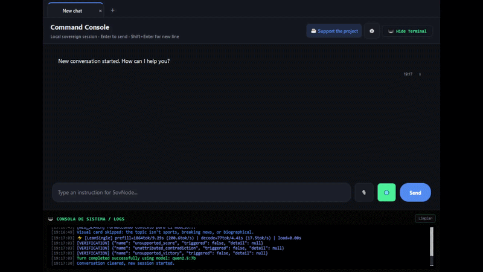
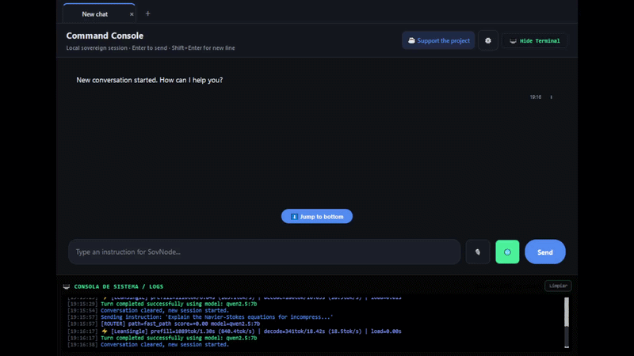
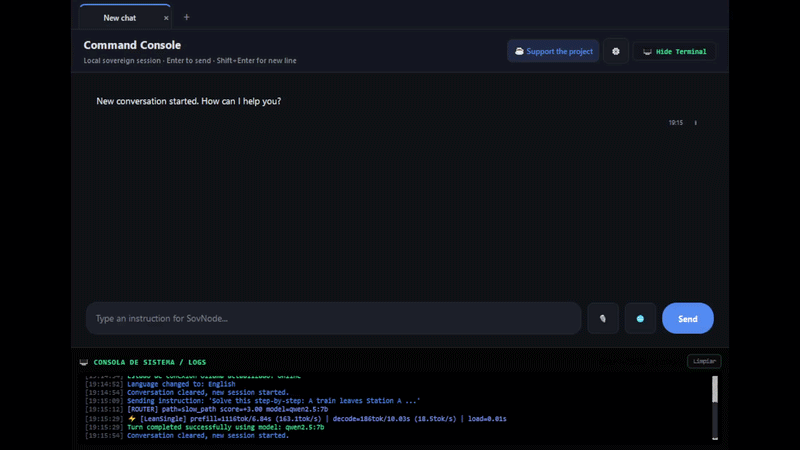
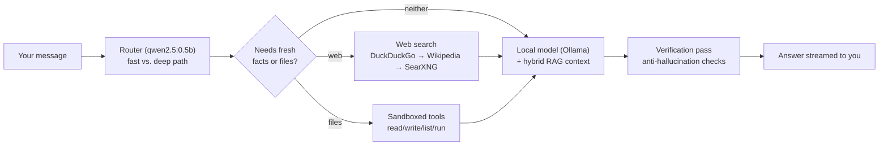

# SovNode

### Sovereign AI Node — a private, 100% offline AI workstation for your desktop

<p align="center">
  
</p>

<p align="center">
  
  
  
  
  
</p>

**SovNode** is a privacy-first desktop client that runs and orchestrates local AI workflows entirely on your own hardware. Everything — inference, memory, retrieval, tool execution — happens on your machine through [Ollama](https://ollama.com); nothing is ever sent to a cloud server. Built with PyQt6, it gives you a full assistant experience — chat, code, voice, file tools, web-grounded search — without giving up control of your data.

---

## Table of Contents

- [Why SovNode](#why-sovnode)
- [Features](#-features)
- [Demo](#-demo)
- [Getting Started](#-getting-started)
- [Model Setup](#️-model-setup-ollama)
- [How It Works](#-how-it-works)
- [Extending SovNode](#-extending-sovnode)
- [System Requirements](#-system-requirements)
- [Benchmarks](#-benchmarks--system-evals)
- [Privacy & Security](#-privacy--security)
- [Localization](#-localization)
- [Contributing](#-contributing)
- [License](#-license)

---

## Why SovNode

Most AI assistants ask you to trust a company with your prompts, your files, and your habits. SovNode flips that: the model, the memory, the retrieval index, and every tool call live in a sandbox on *your* disk. You decide which model runs, which folders it can see, and when — if ever — it's allowed to reach out to the web.

## ✨ Features

| | |
|---|---|
| 🔒 **Local-first & private** | 100% local inference via Ollama — full data sovereignty, with *optional* hybrid web grounding only when a query genuinely needs live facts. |
| 🧠 **Single unified model** | One general-purpose model (`qwen2.5:7b` by default) handles both reasoning and code — no separate coder model to juggle, and it's a drop-in swap to any Ollama model you prefer. Point it at a `gpt-oss`-family model and it automatically switches on Harmony `think`-budget tuning. |
| ⚡ **Instant intent routing** | A lightweight `qwen2.5:0.5b` router classifies every message in milliseconds and decides between a fast conversational path and a deeper reasoning path — so simple questions don't pay the cost of complex ones. |
| 📚 **Hybrid memory & RAG** | Combines FAISS vector search with SQLite full-text search (FTS5) over your conversation history, cached web knowledge, and indexed files — with AST-aware chunking for Python source. |
| 📁 **Live workspace indexing** | Add one or more project folders as a "Workspace"; SovNode watches them in the background, re-indexes on change, and keeps the list persisted across restarts. |
| 🛠️ **Sandboxed tool engine** | The model can read, write, and list files and run shell commands — all boxed inside a validated sandbox root that always matches your active workspace, never your filesystem at large. |
| 🧩 **Extensible without code** | Drop a `.json` spec into `custom_tools/` to register a brand-new tool — no Python required. |
| 🐍 **Sandboxed code execution** | LLM-generated Python runs through an AST allow-list and an isolated subprocess before it ever touches your system. |
| ✅ **Anti-hallucination verification** | A deterministic post-hoc pass checks claims like scores and outcomes against retrieved evidence and self-corrects before the answer reaches you. |
| 🖩 **Math & LaTeX rendering** | Inline LaTeX is detected and rendered to crisp images in the chat, including boxed/framed expressions. |
| 🎙️ **Voice in, voice out** | Local speech-to-text (faster-whisper) and text-to-speech (pyttsx3) — no cloud STT/TTS APIs. |
| 🧾 **Durable memory (WAL)** | Every turn is fsync'd to a write-ahead log, so your history survives a crash — and can be exported as a DPO/SFT dataset for fine-tuning your own model on your own corrections. |
| 🌗 **Modern PyQt6 UI** | Streaming responses, a live system console, dark/cyberpunk theming, and a persistent session sidebar. |
| 🌐 **Bilingual** | Full interface and assistant responses in Spanish and English. |

## 🖼 Demo

<p align="center">
  
  <br><em>Streaming chat, routing, and tool calls</em>
</p>

<br>

<p align="center">
  
  <br><em>Live system console / telemetry</em>
</p>

## 🚀 Getting Started

### Option A — Prebuilt release (recommended)

1. Install [Ollama](https://ollama.com) and make sure it's running.
2. Go to the **[Releases](../../releases)** tab of this repository.
3. Download the latest **`SovNode.zip`**.
4. Extract it and run **`SovNode.exe`**. No Python setup required.

### Option B — Run from source

```bash
git clone https://github.com/Diaz01245/SovNode.git
cd SovNode
pip install -r requirements.txt
```

Then launch whichever client you want:

```bash
# Main desktop client (PyQt6)
python src/ui/sovnode_qt.py

# Alternate lightweight UI (Streamlit, browser-based)
streamlit run app.py
```

## ⚙️ Model Setup (Ollama)

- **OS:** Windows 10 / 11 (64-bit)
- **Backend:** Ollama running locally at `localhost:11434`

Pull the default models before launching:

```bash
ollama pull qwen2.5:7b      # general reasoning + code
ollama pull qwen2.5:0.5b    # fast intent router
```

Want a different model? Set `OLLAMA_MODEL` (or `OLLAMA_ROUTER_MODEL` for the router) to any tag you've pulled — SovNode reads it at startup, no code changes needed.

## 🧠 How It Works



Every turn is classified, given only the context it needs (recent history, retrieved documents, workspace files, web results when relevant), generated locally, and checked before it reaches the screen — all without leaving your machine unless you explicitly allow a web search.

## 🧩 Extending SovNode

- **Custom tools, no code:** add a `.json` file under `custom_tools/` describing a command template and its parameters, and SovNode registers it as a callable tool automatically.
- **Fine-tune on your own corrections:** every time you correct a response, SovNode can export the (original, corrected) pair from its write-ahead log as training data (`training_export.py`) for DPO/SFT fine-tuning.
- **Swap the model anytime:** any model available in your local Ollama install works — the routing, tools, and verification layers are model-agnostic.

## 💻 System Requirements

SovNode runs entirely on your local machine using Ollama for inference — the app itself is lightweight; response speed depends on your CPU/GPU.

| | Minimum | Recommended |
|---|---|---|
| **OS** | Windows 10/11 (64-bit) | Windows 10/11 (64-bit) |
| **CPU** | 4-core, AVX2 support | Modern 6- to 8-core |
| **RAM** | 16 GB | 16 GB+ |
| **GPU** | 4 GB VRAM | Dedicated GPU, 8 GB+ VRAM |
| **Storage** | 15 GB free (Ollama + models + app data) | 25 GB+ free SSD space |

## 📊 Benchmarks & System Evals

Measured on the reference testbed below — actual throughput depends heavily on your own CPU/GPU.

- **Testbed hardware:** AMD Radeon RX 5500 XT (8GB VRAM) / 16GB system RAM
- **Inference throughput:** 15.5 – 19.0 tokens/sec continuous generation (Q4_K_M quantization)
- **Router latency:** < 20 ms intent classification with `qwen2.5:0.5b`
- **VRAM control:** dynamic `keep_alive` offloading — 0 MB leaked across model swaps
- **UI thread stability:** fully async PyQt6 execution — 0% frame drops during web scraping / RAG ingestion

## 🔒 Privacy & Security

- **No cloud calls for inference.** Every model response is generated by your local Ollama instance.
- **Sandboxed file access.** The model can only read/write within the active workspace folder, never your filesystem at large.
- **Sandboxed code execution.** LLM-generated Python is checked against an AST allow-list and run in an isolated subprocess.
- **Web search is opt-in.** It only fires when a query needs it (or when you force it), and results are clearly attributed.
- **You own your data.** History, memory, and knowledge live in a local SQLite database and write-ahead log on your disk — nowhere else.

## 🌐 Localization

The interface and assistant responses are available in **Spanish** and **English**, switchable from the UI at any time.

## 🤝 Contributing

Issues and pull requests are welcome. If you're proposing a larger change, please open an issue first to discuss the approach.

## 📄 License

Distributed under the **GNU Affero General Public License v3.0 (AGPLv3)**. See [`LICENSE`](LICENSE) for the full text.
